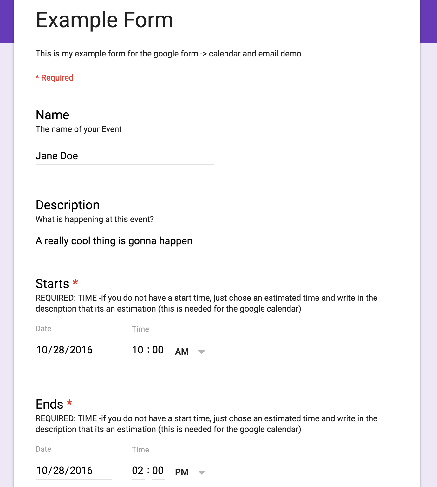
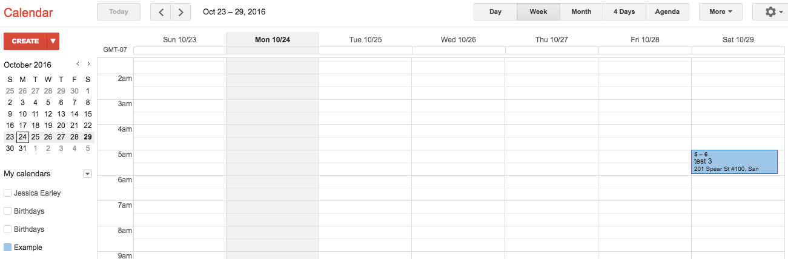
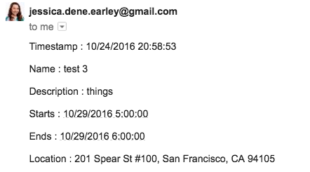

Google Form -> Email and Calendar
---------------------------------

**Description**

A script for when a Google Form is submitted, it sends out email(s) and creates a google Calendar event and invites who you emailed. 

**How it works**

The spreadsheet of the Google Form has a trigger that collects the data needed for the event, then creates a calendar event, invites members and then sends an email with the information.    

### Screenshot

**Example of Google Form**

**Example of Calendar Event Created**

**Example of Email Sent**

### Technology Stack

JavaScript

### How to run Rideminder locally

Step-by-step guide on connecting Google apps using this script at [Doing More with Google Form](http://chatasweetie.com/2016/10/26/doing-more-with-google-form-google-form-submit-sends-email-and-creates-google-calendar)

### About the Developer    
Jessica Dene Earley    
[Bio](https://chatasweetie.com/about-me/)   
[Linkedin](https://www.linkedin.com/in/jessicaearley)    
[Blog](https://chatasweetie.com/)    
